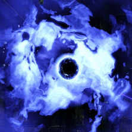

**Latest Release Version:** [0.11.0](https://github.com/HubSpot/Singularity/releases/tag/Singularity-0.11.0)

**Mesos Version:** [0.28.2](http://mesos.apache.org/documentation/latest/upgrades/)

## Overview ##

Singularity is an API and web application for running and scheduling [Apache Mesos](http://mesos.apache.org/) tasks — including long running processes, scheduled jobs, and one-off tasks.

It focuses on a batteries-included approach: Singularity and its components provide an entire Platform as a Service (PaaS) to end-users. It has many features which have been introduced to reduce developer friction and ensure proper operation and reliable deployment of tasks. Users may even be unfamiliar with and shielded from the details of Mesos.

For a more thorough explanation of the concepts behind Singularity and Mesos click [here](Docs/about/how-it-works.md).

----------

### Features###

 - [Native Docker Support](Docs/reference/container-options.md)
 - [JSON REST API and Java Client](Docs/reference/apidocs/api-index.md)
 - [Fully featured web application (replaces and improves Mesos Master UI)](Docs/about/ui.md)
 - Rich load balancer integration with [Baragon](https://github.com/HubSpot/Baragon)
 - [Deployments, automatic rollbacks, and healthchecks](Docs/about/how-it-works.md#deploys)
 - [Webhooks for third party integrations](Docs/reference/webhooks.md)
 - Configurable email alerts to service owners
 - [Historical deployment and task data](Docs/reference/database.md)
 - [Custom executor with extended log features](Docs/about/how-it-works.md#optional-components)

----------
### 编译 ###
- java 
`mvn clean package -DskipTests`
- ui
单独在SingularityUI下面执行`gulp` 进行编译，然后把dist下面内容放在SingularityService的assets目录里

### 结构 ###
- 后端
主入口是SingularityService里面的IndexView
url映射是是resources目录

- 前端react
界面元素是在app/components下面定义，使用url
数据获取、url定义等是在app/actions/api下面定义
界面与数据是通过url来绑定的

### Try It Out! ###

If you want to give Singularity a try, you can install [docker](https://docs.docker.com/installation/) and [docker-compose](https://docs.docker.com/compose/#installation-and-set-up) to run our example cluster.

Run `docker-compose pull` first to get all of the needed images. *Note: This may take a few minutes*

Then simply run `docker-compose up` and it will start containers for...
- mesos master
- mesos slave (docker/mesos containerizers enabled)
- zookeeper
- Singularity
- [Baragon Service](https://github.com/HubSpot/Baragon) for load balancer management
- [Baragon Agent](https://github.com/HubSpot/Baragon) + Nginx as a load balancer

...and the following UIs will be available:
- Singularity UI => [http://localhost:7099/singularity](http://localhost:7099/singularity)
- Baragon UI => [http://localhost:8080/baragon/v2/ui](http://localhost:8080/baragon/v2/ui)

*if using [boot2docker](http://boot2docker.io/) or another vm, replace localhost with the ip of your vm*

----------

## Getting Started ##
##### Requirements #####

 - [Mesos](http://mesos.apache.org/gettingstarted/)
 - [ZooKeeper](https://zookeeper.apache.org/doc/r3.4.6/zookeeperStarted.html) 
 - Java 7+
 - [MySQL](http://dev.mysql.com/usingmysql/get_started.html) (optional)

##### Contact #####

- [singularity-users@googlegroups.com](mailto:singularity-users@googlegroups.com) // [singularity-users](https://groups.google.com/forum/#!topic/singularity-users/)
- \#singularity-framework on freenode

----------

## Reference ##

#### Install ####

 - [Installation Instructions](Docs/getting-started/install.md)

#### Deployment ####

 - [API](Docs/reference/apidocs/api-index.md)
 - [Configuration](Docs/reference/configuration.md)
 - [Examples](Docs/getting-started/basic-examples.md)
 - [`Request` and `Deploy` Concepts](Docs/about/requests-and-deploys.md)
 - [Custom Executor Components](Docs/about/how-it-works.md#optional-components)

#### Development ####

- [Local Development with Docker](Docs/development/developing-with-docker.md)
- [Hacking on the UI](Docs/development/ui.md)
- [Understanding the basepom / Maven structure](Docs/development/basepom.md)
- [Third-party load balancer API design requirements](Docs/development/load-balancer-integration.md)

----------

Singularity is built and used by a number of different companies. Check out the list of adopters [here](Docs/about/adopters.md). 
